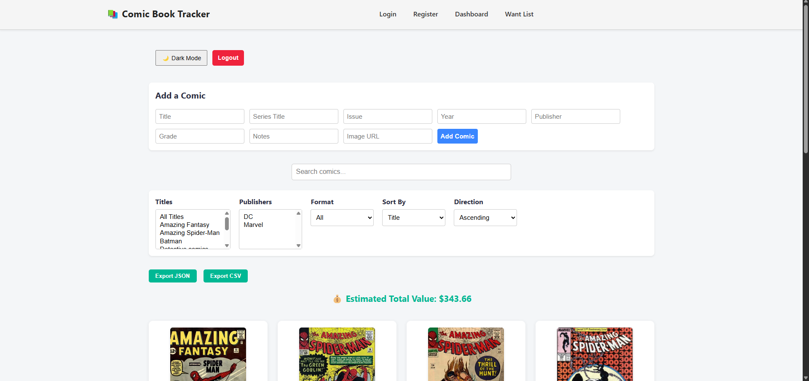
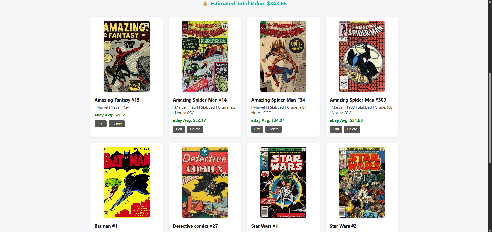
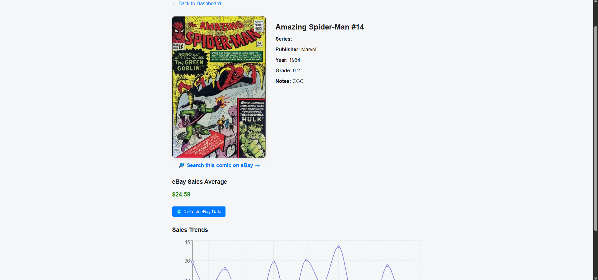
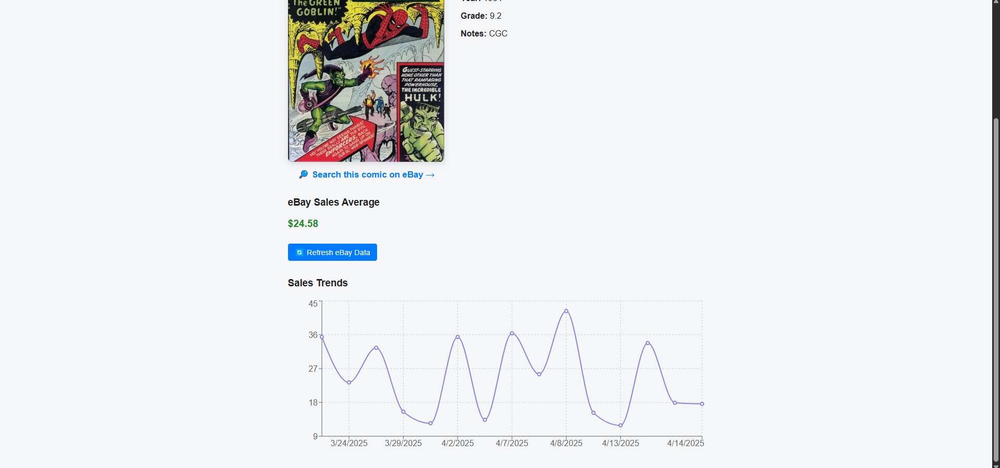

# 📚 Comic Book Tracker

A full-stack MERN application to manage your comic book collection with advanced filtering, price tracking, secure auth, and a responsive UI.  
Built for collectors and polished to showcase full-stack dev skills.

---

## 🚀 Features

- ✏️ Add, edit, and delete comics  
- 🖼️ Upload cover image URLs with clickable thumbnails  
- 🔍 Click to enlarge thumbnails in a modal  
- 🧠 Auto-detects slabbed/raw status from grade and notes  
- 🔐 JWT-based auth with refresh token support and session timeout  
- 🔁 Password reset via secure email link (Gmail app password)  
- 🎨 Light/Dark theme toggle  
- 📊 eBay average sales price per comic (mocked for now)  
- 📈 Chart of recent sales trends  
- 🔗 Link to eBay search for each comic  
- 🧰 Filter by title, publisher, slabbed/raw format  
- 🔎 Live keyword search  
- 📤 Export collection as JSON or CSV  
- 📱 Mobile-first responsive design  

---

## 🖼️ Preview

### 📋 Dashboard View


### 🗂️ Collection View


### 📘 Comic Details
  


---

## 🛠️ Tech Stack

- **Frontend:** React (Vite), React Router  
- **Backend:** Node.js, Express  
- **Database:** MongoDB Atlas (via Mongoose)  
- **Auth:** JWT + Refresh Tokens, Email Password Reset  
- **Styling:** Vanilla CSS  
- **External API:** eBay Browse API (mock data until production access)  
- **Charts:** Chart.js (`react-chartjs-2`)  

---

## 🧪 Local Setup

### Prerequisites

- Node.js & npm  
- MongoDB Atlas  
- GitHub  
- Gmail App Password  
- (Optional) eBay Dev Account for future API key

---

### 1. Clone & Install

```bash
git clone https://github.com/dB-XIX/comic-tracker.git
cd comic-tracker

# Client
cd client && npm install

# Server
cd ../server && npm install
```

---

### 2. Create `.env` in `/server`

```env
MONGO_URI=your_mongodb_uri
JWT_SECRET=your_jwt_secret
JWT_REFRESH_SECRET=your_refresh_token_secret

EMAIL_HOST=smtp.gmail.com
EMAIL_PORT=587
EMAIL_USER=your_gmail_address
EMAIL_PASS=your_app_password
EMAIL_FROM="Comic Tracker <your_gmail_address>"
```

---

### 3. Run the App

```bash
# Terminal 1 - Server
cd server
npm run dev
```

```bash
# Terminal 2 - Client
cd client
npm run dev
```

View the app: [http://localhost:5173](http://localhost:5173)

---

## 🔐 Authentication & Security

- Login expires after 30 minutes of inactivity  
- Refresh token infrastructure ready for future enhancements  
- Email-based password reset using secure Gmail app password  
- Input sanitization and route protection throughout  

---

## 📈 Roadmap

- 🔌 Live eBay API integration (pending keyset exemption)  
- 🧾 Log and compare long-term comic price history  
- ✅ "Mark as Acquired" from Want List  
- 📷 Support image file uploads (not just URLs)  
- 🧠 Experimental AI-based grade estimation from photo & notes  

---

## 👤 Author

**Michael**  
GitHub: [dB-XIX](https://github.com/dB-XIX)  
Full-stack dev building powerful, practical apps for real-world use and hireability.

---

## 📄 License

This project is not open for public use or deployment.  
All rights reserved — use, reproduction, or distribution without explicit permission is prohibited.
